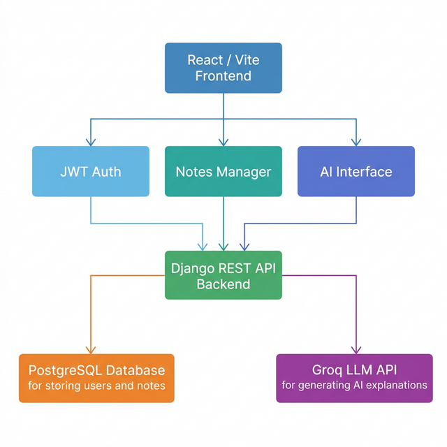

# AI Study Assistant Platform

> A comprehensive, full-stack application designed to help students learn effectively by providing AI-powered explanations, summaries, quizzes, and note management. 
> Features a sleek, modern Glassmorphism frontend and a robust, scalable Django REST backend.

 

---

## 📚 Overview

The AI Study Assistant Platform is a two-part system designed for educational acceleration. Students can create study notes, interact with an AI assistant (powered by Groq / Llama-3.1-8b), and directly save AI-generated study material into their library.

**Key capabilities:**
- 🎒 **Study Library:** Create, update, search, and manage study notes.
- 🤖 **AI Assistant:** 4 different AI study modes (Explain, Quiz, Summarize, Examples) that can use existing notes as context.
- 🔐 **Authentication:** JWT-based user authentication.
- 🛠️ **Admin Panel:** Manage users, monitor AI requests, and moderate study notes.
- 🎨 **Premium UI:** A beautifully animated, highly responsive Glassmorphism interface.

---

## 🏗️ Architecture



---

## 🚀 Tech Stack

### 🖥️ Frontend
- **React 18** + **Vite**
- **Tailwind CSS** (with extensive custom themes and animations)
- **Framer Motion** (for page transitions and animated data grids)
- **Lucide React** (for modern typography/icons)
- **React Markdown** (for rich text formatting)

### ⚙️ Backend
- **Django 4.2** + **Django REST Framework**
- **SimpleJWT** (Access/Refresh token rotation & blacklisting)
- **PostgreSQL 16** (Primary Data Store)
- **Groq API** (Llama-3.1-8b-instant LLM Provider)
- **Drf-Spectacular** (OpenAPI 3.0 Documentation)

---

## 🐳 Quick Start (Docker)

The absolute easiest way to get the entire platform running is via Docker Compose.

### Prerequisites
- Docker & Docker Compose installed
- A [Groq API key](https://console.groq.com)

### 1. Configure the Backend Environment
Navigate to the `backend/` directory and configure your environment variables:
```bash
cd backend
cp .env.example .env
```
Open `backend/.env` and insert your API key:
```env
GROQ_API_KEY=your_actual_groq_api_key_here
```

### 2. Boot the Containers
From the root directory of the project, run:
```bash
docker-compose up --build
```
This single command will:
1. Start the PostgreSQL database
2. Build and start the Django REST API (port `8000`)
3. Automatically run all database migrations
4. Build and start the React+Vite frontend (port `5173`)

### 3. Access the Application
- **Frontend App:** [http://localhost:5173](http://localhost:5173)
- **Backend API Docs (Swagger):** [http://localhost:8000/api/docs/](http://localhost:8000/api/docs/)
- **Django Admin GUI:** [http://localhost:8000/django-admin/](http://localhost:8000/django-admin/)

---

## 📂 Project Structure

```text
ai_study_platform/
├── docker-compose.yml       # Orchestrates Database, API, and Frontend
│
├── backend/                 # Python/Django REST API
│   ├── apps/                # Django domain apps (ai, notes, users)
│   ├── config/              # Django settings and URL routing
│   ├── Dockerfile           # Python 3.10-slim build definition
│   ├── requirements.txt     # Python dependencies
│   └── README.md            # Extensive backend documentation
│
└── frontend/                # React/Vite Application
    ├── src/                 # React components, pages, states, API configs
    ├── Dockerfile           # Node 18-alpine build definition
    ├── tailwind.config.js   # UI design system tokens
    └── README.md            # Frontend specific documentation
```

---

## 🔑 Default Users

Out of the box, no user is created automatically. To instantly create the default administrator with `admin@admin.com` and password `Admin1234!`, run the following command while your containers are running:

```bash
docker-compose exec backend python manage.py shell -c "
from apps.users.models import User
if not User.objects.filter(email='admin@admin.com').exists():
    User.objects.create_superuser('admin', 'admin@admin.com', 'Admin1234!')
    print('Default admin created successfully!')
else:
    print('Admin already exists.')
"
```

Once executed, you can log in to the application at `http://localhost:5173/login`. Admins have exclusive access to the highly detailed **Admin Panel** tab.

---

*Built with ❤️ utilizing Advanced Modern Architecture.*
